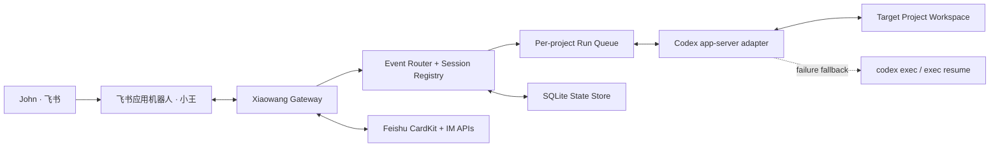
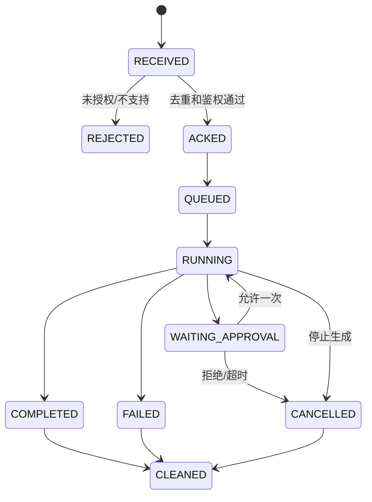

# 小王飞书 Codex 项目网关方案

- 日期：2026-07-13
- 版本：v2.0
- 状态：实施与验收中
- 文档类型：产品与技术基线
- 目标用户：John
- 首个目标项目：John Codex Context（当前仓库）

### v2 变更

- 日常入口不再区分工程任务、分析任务、只读任务；
- 菜单和 Session 卡片不再暴露分叉；
- 内部保留 Codex fork 能力，仅供未来显式跨机器接手等高级流程使用。

## 1. 结论

这件事可做，没有不可解的结构性阻塞。

但应把它定型为“小王飞书 Codex 项目网关”，而不是“飞书消息转发脚本”：

> John 在飞书与小王对话，小王把消息可靠地路由到指定机器、指定 project、指定 Codex session，并以表情、流式卡片和交互审批承接完整的 Codex 工作过程。

本方案做出六个核心决策：

1. **一个逻辑 project，多 session。** 默认主 session 保持简单体验，明确换题时创建新 session。
2. **飞书菜单是固定入口，动态 session 管理由卡片承担。** 不把动态状态硬塞进静态菜单。
3. **正常回答统一使用 Card 2.0。** 纯文本只作为接口故障或旧客户端兼容兜底。
4. **真正的流式链路使用 Codex app-server 的消息增量事件对接飞书 CardKit。** `codex exec --json` 只作为降级通道，因为当前实测不输出文本增量。
5. **桥接服务与目标 project 分离。** 小王是控制面，project 是被操作的工作区，避免机器人修改自身运行代码导致失控。
6. **生产宿主机优先使用常驻 M4 Mac mini。** 但必须接受一个事实：Codex session 是机器本地状态，M4 session 不会天然等同于当前 Mac 上的 Desktop task。

## 2. 第一性原理：最终要得到什么

目标不是“在飞书收到 AI 回复”，而是让飞书成为一个足够可信的 Codex 客户端。

终态必须同时满足：

- **同一个助手**：遵守 John 的 `AGENTS.md`、skills、记忆和工程纪律。
- **同一个项目**：所有文件读写、Git 状态和验证都发生在被明确绑定的 project 内。
- **上下文连续**：同一任务可以持续追问，不同任务不互相污染。
- **反馈即时**：消息发出后马上知道已接收、正在做什么、是否等待确认。
- **输出可读**：默认是富文本卡片，长回答和代码不退化成难看的纯文本。
- **动作可控**：高风险操作不能因为从飞书发出就绕过确认。
- **状态可恢复**：服务重启、事件重复、网络抖动后不会重复执行或永久卡在“处理中”。
- **可接手**：未来可以从飞书切回桌面继续工作，但不能伪造跨机器的同一 session。

如果只实现消息收发，而没有 session、权限、幂等、并发和恢复机制，它只是一个演示，不是工作入口。

## 3. 明确边界

### 3.1 本期范围

- John 与小王一对一聊天。
- 固定绑定首个逻辑 project。
- 支持新建、选择、重命名、归档 Codex session。
- 收到消息后添加处理表情，结束后清理。
- 回答使用飞书 Card 2.0 原生流式更新。
- 支持停止生成。
- 支持 Codex 命令和文件变更审批卡片。
- 支持服务重启后的状态恢复和重复事件去重。
- 支持小王自定义菜单。

### 3.2 暂不纳入第一版

- 群聊多人共享一个 project。
- 任意用户动态输入本地路径。
- 多 project 自助注册。
- 跨机器同时写同一个 Codex session。
- 无限制并发工程任务。
- 自动部署、自动 push、自动外部发消息而不确认。
- 把隐藏推理过程或完整命令日志流式发到飞书。

## 4. 宿主机与“同一个 session”的真实含义

### 4.1 必须区分三个概念

| 概念 | 是否跨机器天然共享 | 说明 |
| --- | --- | --- |
| 逻辑 project | 可以 | 用稳定 `project_id` 标识，各机器映射到自己的绝对路径 |
| 项目文件和审阅记忆 | 有条件可以 | 通过 Git 和既有 portable memory 规则同步，不同步密钥和本机状态 |
| Codex session | 不可以 | session 存在宿主机本地 `CODEX_HOME`，不能把两台机器上的 session 当成同一个 |

### 4.2 推荐决策

- **开发与协议验证**：先在当前机器完成，因为能直接验证当前 Codex 版本和目标仓库。
- **生产运行**：迁移到常驻 M4 Mac mini，因为小王应用已经绑定在该执行节点，机器也更适合长期在线。
- **生产 session 的权威宿主**：M4。飞书创建和恢复的 session 以 M4 本地 Codex thread ID 为准。
- **当前 Desktop task**：不能默认由 M4 小王直接续接。未来如需要跨机器接手，应做显式“handoff / fork”，而不是同步整个 `~/.codex`。

### 4.3 部署前硬门槛

M4 上必须存在：

- 首个 project 的有效 checkout；
- 正确的 `AGENTS.md` 指针和 portable memory；
- 可用且已登录的 Codex；
- 正确的小王飞书应用配置；
- 唯一的飞书事件入口。

小王应用可能已经被其他个人自动化使用。部署前必须盘点现有 WebSocket/Event consumer。**同一个应用的入站事件只能有一个权威入口**，其他功能应由入口内部路由，不能盲目再起第二个竞争消费者。

## 5. 总体架构



### 5.1 组件职责

#### Feishu ingress

- 使用飞书官方 Node SDK 的 WebSocket 长连接接收消息、机器人菜单事件和卡片回调。
- 不要求暴露公网 callback URL。
- `lark-cli` 保留为授权检查、事件诊断和运维工具，不承担生产消息服务器职责。

#### Gateway

- 校验发送者和会话类型。
- 用 `event_id` 去重。
- 添加、删除处理表情。
- 渲染、发送和更新 Card 2.0。
- 把飞书操作转成统一内部命令。
- 管理审批卡片和停止生成。

#### Session registry

- 维护飞书会话与 Codex thread 的映射。
- 维护默认 session、当前 session、归档和标题。
- 不复制 Codex 完整历史；Codex thread 本身是对话事实源。

#### Codex adapter

- 主通道：本地 stdio 连接 `codex app-server`。
- 降级通道：`codex exec --json` 和 `codex exec resume`。
- 主通道消费 `thread/start`、`thread/resume`、`turn/start`、`item/agentMessage/delta`、`turn/interrupt` 和 approval request。
- 只向飞书展示安全的状态和最终输出，不展示隐藏推理。

#### State store

- SQLite + WAL。
- 存路由、运行状态、去重键、卡片 ID、reaction ID 和审批状态。
- 不存 app secret、access token、Codex 登录态或完整 session 副本。

## 6. 为什么主通道必须是 app-server

2026-07-13 本机运行时核对结果：

- `codex-cli 0.144.0-alpha.4` 支持 app-server、thread start/resume、turn start/interrupt。
- 本机生成的 app-server 协议 schema 包含 `item/agentMessage/delta`、命令审批请求和文件变更审批请求。
- 对 `codex exec --ephemeral --json` 的无写入实测只得到四类事件：`thread.started`、`turn.started`、完整的 `item.completed/agent_message` 和 `turn.completed`，没有文本 delta。

因此：

| 通道 | session 恢复 | 真正文本增量 | 远程审批 | 停止 turn | 定位 |
| --- | --- | --- | --- | --- | --- |
| app-server | 支持 | 支持 | 支持 | 支持 | 正式主通道 |
| exec JSONL | 支持 | 当前不支持 | 不适合作为飞书交互审批 | 只能进程级终止 | 故障降级 |

app-server 目前仍标记为 experimental，所以必须用适配器隔离，并固定以下防漂移措施：

1. 部署时记录 Codex CLI 版本。
2. 启动前生成或读取协议 schema，运行 contract test。
3. 关键 method 或字段缺失时拒绝启动主通道，切到明确标记的降级模式。
4. 降级模式只显示状态动画和最终结果，不伪造 token 流式。
5. 升级 Codex 前先跑协议回归，再替换生产版本。

## 7. 飞书交互设计

### 7.1 自定义菜单

采用三个主菜单，兼容可切换菜单的数量限制：

```text
会话
├─ 新建会话
├─ 切换会话
└─ 当前会话

管理
├─ 重命名会话
├─ 归档会话
└─ 运行状态

控制
├─ 停止生成
└─ 使用帮助
```

原则：

- 菜单使用“推送事件”作为正式方式，不在聊天里制造 `/new` 等命令文本。
- 若菜单事件链路不可用，才降级为“发送文字消息”。
- 菜单配置需要随应用版本发布，不能当成运行时动态 session 列表。
- 机器人菜单只支持单聊，因此第一版也只承诺单聊。

### 7.2 Session 管理卡片

点击“选择 Session”后发送动态卡片，内容包括：

- session 标题；
- 当前、运行中、排队、等待确认、空闲、已归档状态；
- 最后活跃时间；
- 当前 project；
- 分页；
- 切换、新建、重命名、归档按钮。

切换 session 只改变该飞书 scope 的 `active_session_id`。已经开始的 run 继续绑定原 session，不因用户切换而漂移。

### 7.3 标准回答卡片

每个用户 turn 对应一张回答卡片实体：

```text
┌────────────────────────────────┐
│ 小王 · 公园日常工作             │
│ Session：小王机器人接入方案       │
├────────────────────────────────┤
│ 已接收 / 正在分析 / 正在执行工具   │
├────────────────────────────────┤
│ Markdown 流式回答区域             │
├────────────────────────────────┤
│ 用时 · 模型 · 运行状态             │
│ [停止] [继续追问] [新建 Session]   │
└────────────────────────────────┘
```

卡片规范：

- Card JSON 2.0；
- `streaming_mode=true`；
- 回答主体使用一个稳定 `element_id` 的 Markdown 组件；
- 200–500ms 合并一次 Codex delta，且绝不超过飞书单卡 10 次/秒限制；
- 每次向飞书发送当前全量正文，由 CardKit 计算增量并呈现打字机效果；
- 流式结束后关闭生成状态，再补充操作按钮和最终元数据；
- 卡片接近 30KB 上限时，在安全阈值前结束当前卡片并发送“续页卡片”；
- 不在卡片里输出隐藏推理、密钥、完整环境变量或未经裁剪的终端日志。

旧于飞书 7.20 的客户端不能完整显示 Card 2.0。兼容顺序是：Card 2.0 → 富文本 `post` → 极端故障下纯文本。

### 7.4 表情确认

生命周期：

```text
收到消息 → 鉴权/去重成功 → 添加处理中表情
        → 创建回答卡片 → Codex 执行
        → 完成/失败/取消 → 更新最终卡片
        → 删除机器人自己添加的表情
```

- 创建 reaction 后立即保存 `reaction_id`。
- 删除动作放在 run 的 `finally` 和启动时的 stale cleanup 中。
- 等待审批时移除“处理中”，卡片改为“等待你的确认”。
- 不用完成表情制造额外噪声；最终状态由卡片表达。

### 7.5 审批卡片

app-server 发出命令或文件变更审批请求时，小王发送独立审批卡片：

- 动作类型；
- 目标 project 和 cwd；
- 完整但脱敏的命令或文件范围；
- 风险解释；
- `允许一次` / `拒绝`；
- 默认超时后拒绝。

第一版不提供“永久允许此命令”，避免飞书按钮把临时授权扩成长期后门。

## 8. Session 模型

### 8.1 核心规则

- 一个逻辑 project 可以有多个 Codex session。
- 每个飞书单聊有一个默认 session 和一个 active session。
- John 普通发消息时进入 active session。
- 新 session 只能由明确动作创建：菜单、session 卡片或明确自然语言指令。
- 不根据语义擅自拆分 session；语义换题只提示，不自动执行。
- 同一飞书消息只允许创建一个 run。

### 8.2 飞书 thread 的处理

- 普通单聊使用 `chat_id` 作为 scope。
- 若消息位于飞书 thread，则使用 `chat_id + root_message_id/thread_id` 作为独立 scope。
- thread scope 默认创建或绑定独立 Codex session，不覆盖单聊主 session。

### 8.3 新建与切换

- `切换`：后续消息进入另一个已有 session。
- `新建`：创建空白 session，但仍加载同一个 project 规则和记忆入口。
- `归档`：不删除 Codex 历史，只从默认列表隐藏。

日常入口不提供分叉或只读类型选择。内部 Codex fork 能力只作为未来显式 handoff 等高级流程的实现基础，不进入常用菜单和 Session 卡片。

## 9. 消息与运行状态机



关键不变量：

- `event_id` 唯一，重复事件直接返回已有 run 状态。
- 一个 session 同时最多一个 active turn。
- 第一版一个 project 同时最多一个可写 run。
- session 切换不会改变已启动 run 的绑定。
- 失败或重启后不会自动重放可能产生副作用的 turn。
- reaction 最终必须被清理。

## 10. 并发与工作区安全

多 session 解决的是上下文隔离，不等于可以让多个 agent 同时修改同一个目录。

第一版采取保守策略：

- 同一 session 串行；
- 同一 project 的可写任务串行；
- 新消息可排队、取消或切换到其他 session，但不会绕过 project 写锁；
- Codex 每次开始前读取真实 `git status`；
- 不回滚、不覆盖既有未提交修改；
- 桥接服务自己的代码不放在目标 project 内。

后续需要并行工程任务时：

- 每个可写 run 创建独立 Git worktree；
- session 绑定 worktree；
- 完成后通过明确的合并/提交流程回主工作区；
- 非 Git project 不自动并发写入。

## 11. 权限和安全模型

### 11.1 身份

- 第一版只允许 John 的飞书 `open_id`。
- 只处理 P2P 消息。
- 群聊消息即使 @ 小王也默认拒绝执行 project 操作。
- 卡片回调必须再次校验 operator，不信任卡片中传回的 session/project 参数。

### 11.2 Project allowlist

服务端配置固定 registry：

```yaml
projects:
  john-codex-context:
    display_name: 公园日常工作
    workspace_path: /absolute/path/on-host
    allowed_users:
      - john_open_id
```

- 用户不能通过消息提供新的绝对路径。
- 所有 cwd 必须 `realpath` 后仍处于 allowlist 根目录。
- 外部目录只能通过新版本配置显式加入。

### 11.3 动作分级

| 等级 | 例子 | 默认处理 |
| --- | --- | --- |
| 自动 | 读取、搜索、状态检查、测试 | 直接执行 |
| Project 内写入 | 编辑目标文件、生成测试 | 按 Codex sandbox/approval policy 执行并保留变更报告 |
| 高风险 | 删除、覆盖大量文件、访问 project 外路径 | 飞书审批卡片，允许一次 |
| 外部副作用 | push、deploy、发消息、数据库写入、权限变更 | 必须明确审批，不做持久授权 |
| 禁止 | 输出密钥、同步 `~/.codex`、静默扩大权限 | 永不执行 |

### 11.4 密钥

- 飞书 app secret 放系统 Keychain 或权限为 0600 的受保护配置，不进入 SQLite、Git 或日志。
- Codex 使用宿主机现有认证，不复制 token。
- 日志仅记录 ID、状态、耗时和错误分类，默认不记录完整聊天正文和命令输出。

## 12. 状态存储

建议最小表：

| 表 | 关键字段 | 用途 |
| --- | --- | --- |
| `projects` | `project_id`, `workspace_path`, `host_id` | 逻辑 project 到宿主路径映射 |
| `sessions` | `session_id`, `codex_thread_id`, `project_id`, `title`, `status` | Session 注册表 |
| `bindings` | `feishu_scope_key`, `active_session_id` | 飞书 scope 当前 session |
| `inbound_events` | `event_id`, `message_id`, `received_at` | 幂等去重 |
| `runs` | `run_id`, `session_id`, `turn_id`, `state`, `card_id` | 一次用户 turn 的状态 |
| `reactions` | `message_id`, `reaction_id`, `cleared_at` | 表情清理 |
| `approvals` | `approval_id`, `run_id`, `decision`, `expires_at` | 一次性审批 |

Codex thread 是对话历史事实源；SQLite 只存索引和运行状态，避免形成第二套会话正文。

## 13. 故障恢复

### 13.1 飞书重复事件

- 以 `event_id` 建唯一索引。
- 如果相同事件已完成，返回或定位原卡片，不重新执行。
- 如果仍运行，展示当前状态。

### 13.2 WebSocket 断线

- SDK 自动重连并采用指数退避。
- 重连不清空本地队列。
- 用飞书事件 ID 去重，不依赖“连接只投递一次”。

### 13.3 Gateway 重启

- 启动时扫描 `RUNNING/WAITING_APPROVAL`。
- 不自动重放 turn。
- 将对应卡片更新为“服务重启，本次任务未自动重试”。
- 清理残留 reaction。
- 提供“安全重试”按钮，由 John 明确发起新 run。

### 13.4 Codex app-server 失败

- 当前 turn 标记失败，不静默换引擎重复执行。
- app-server 不可用时可进入 exec 降级模式。
- 降级卡片必须显示“非增量模式”，只流式展示状态，最终一次性写入答案。
- 降级模式不承诺飞书交互审批；需要审批的任务停止并说明原因。

### 13.5 飞书 CardKit 更新失败

- 保留服务器端完整回答缓冲。
- 有界重试并遵守 QPS。
- 流式失败但最终发送成功时，明确降级为一张最终富文本卡片。
- 不能发送卡片时才发送纯文本故障通知。

## 14. 可观测性

每个事件贯穿以下关联 ID：

```text
event_id → message_id → run_id → session_id → codex_thread_id → turn_id → card_id
```

最小指标：

- 消息接收到 reaction 的延迟；
- 首张卡片出现延迟；
- 首个 Codex delta 延迟；
- CardKit 更新失败率和限流次数；
- run 完成、失败、取消、等待审批数量；
- 重复事件命中数；
- stale reaction 数；
- app-server 协议版本和 fallback 次数。

“当前状态”菜单返回健康卡片，至少包含：Feishu WS、Gateway、Codex app-server、目标 project、队列和最近错误。

## 15. 代码与部署边界

### 15.1 推荐代码位置

不要把桥接服务代码直接放入当前 memory/context project，也不要默认塞进 `feishu-obsidian-agent`。

推荐建立独立服务仓库：

```text
~/projects/xiaowang-codex-gateway
```

原因：

- 控制面与被控制工作区隔离；
- 不因 Codex 修改目标 project 而修改自身进程；
- 可以绑定多个逻辑 project，但第一版只开放一个；
- 现有小王 app 的其他功能可以通过统一 event router 接入，而不是多进程竞争同一应用事件。

在正式建仓前，Phase 0 必须审计 M4 上现有小王服务。如果已经有可靠的统一 event ingress，则复用其 router；如果只是独立 Minutes 流程，则网关仍独立建仓，但事件入口只能保留一个。

### 15.2 推荐技术栈

- Node.js + TypeScript；
- 飞书官方 Node SDK；
- SQLite；
- Codex app-server stdio adapter；
- `launchd` 常驻；
- Vitest 或现有等价测试框架；
- 结构化 JSON 日志。

### 15.3 进程模型

- `xiaowang-gateway` 是唯一常驻主进程。
- app-server 作为本机 stdio 子进程，不开放公网端口。
- 主进程通过 `launchd` 拉起和重启。
- 正常退出先停止接收新 run，再 interrupt/收口活动 turn，最后关闭 SQLite。

## 16. 实施阶段与门槛

### Phase 0：协议和环境闸门

目标：先证明最容易被想当然的链路。

必须验证：

1. M4 的真实 project 路径、Git 状态、Codex 登录和 `AGENTS.md` 加载。
2. 当前小王 app 是否已有常驻 event consumer。
3. 官方 SDK 能收到消息、菜单事件和卡片回调。
4. reaction 创建和删除闭环。
5. CardKit 实体创建、发送、Markdown 文本流式更新和结束状态。
6. app-server 能完成 thread start/resume、agent message delta、turn interrupt。
7. app-server 的 command/file approval request 能由测试客户端响应。

**停止条件**：app-server 没有真实 delta 或 CardKit 流式不可用时，不得用定时补字伪造通过；回到架构层重新决定降级体验。

### Phase 1：单 session 完整闭环

- John 私聊发消息；
- reaction 即时出现；
- 创建默认 Codex session；
- 回答在同一卡片流式增长；
- 完成后移除 reaction；
- 支持停止生成；
- 重启后不重复执行。

### Phase 2：多 session 与菜单

- 发布三组机器人菜单；
- session 选择卡片；
- 新建、切换、重命名、归档；
- 默认 session 与飞书 thread scope；
- 卡片分页和并发状态展示。

### Phase 3：远程审批与工程安全

- command/file approval 卡片；
- project 写锁；
- dirty worktree 保护；
- 外部副作用审批；
- 故障恢复和健康卡片；
- 独立 worktree 的并行任务试点。

### Phase 4：附件和接手体验

- 飞书图片、文件作为 Codex 输入；
- 长回答续页和 artifact 链接；
- 显式 handoff/fork 到其他机器；
- 多 project 入口，但仍由 allowlist 管理。

## 17. 第一版验收标准

只有以下条件全部满足，才能称为“可用”，而不是“已经接通”：

- [ ] John 单聊小王发送一条消息，2 秒内出现处理表情或明确接收反馈。
- [ ] 回答默认是一张 Card 2.0，不发送普通纯文本。
- [ ] 能观察到由真实 Codex delta 驱动的同卡流式增长。
- [ ] 完成、失败、取消后处理表情都会被删除。
- [ ] 菜单可以新建会话、选择 session、查看状态、停止生成。
- [ ] Session 卡片可以新建、切换、重命名和归档，不暴露工程/分析/只读任务类型或分叉。
- [ ] 连续两轮进入同一 Codex thread；新 session 不继承旧任务历史。
- [ ] 重复投递同一个飞书事件不会触发第二次 Codex turn。
- [ ] 同一 project 的两个可写请求不会同时修改同一个工作区。
- [ ] 高风险命令和外部副作用必须经过一次性审批卡片。
- [ ] Gateway 重启后不会自动重放未完成的副作用操作。
- [ ] app-server 不可用时明确进入降级模式，不伪造流式或审批能力。
- [ ] 日志中没有 app secret、access token、Codex token 或完整环境变量。
- [ ] M4 上通过 `launchd` 重启机器后能自动恢复服务。

## 18. `/goal` 执行约束

启动 `/goal` 后应遵循：

```text
请遵守 john-engineering-discipline 规则。
```

并按以下顺序执行：

1. 不先建完整系统，先完成 Phase 0 证据包。
2. 不读取或打印 app secret、token、`.env.local`。
3. 不复用未经审计的脏工作区。
4. 行为改动先写失败测试或最小协议复现。
5. 每个 Phase 都必须有 fresh verification，不能用上一步结果代替。
6. 不在没有用户明确授权时发布飞书应用版本、部署、提交、push 或启停现有生产服务。
7. 发现小王已有事件消费者时，先确定唯一入口和迁移方式，不能直接并行启动第二套。
8. 完成汇报必须包含：结论、改动文件、验证命令和结果、剩余风险、下一步动作。

## 19. 已知风险与最终判断

### 风险一：Codex app-server 仍是实验协议

这是本方案最大技术风险，但不是阻塞。通过版本固定、schema contract test、adapter 隔离和 exec fallback 可以控制。若不使用 app-server，就无法同时得到真实文本 delta、远程审批和 turn interrupt，不满足既定终态。

### 风险二：小王现有服务可能占用同一飞书应用事件入口

这必须在 Phase 0 查清。正确解法是统一 ingress 后内部路由，不是让多个进程竞争事件。

### 风险三：生产 session 与当前 Desktop task 不在同一机器

这是事实边界，不应包装成“完全同步”。本期以 M4 上的飞书 session 为权威；跨机器用 handoff/fork，而不是同步原生 Codex 状态。

### 风险四：多 session 可能制造并发写冲突

第一版用 project 写锁消除，后续只有在独立 worktree 下才开放并行写入。

### 最终判断

方案成立，可以进入 `/goal`。

真正的产品定义是：

> 小王不是把飞书消息转给 Codex，而是在飞书里提供一个有项目边界、会话管理、流式卡片、远程审批和故障恢复的 Codex 工作入口。

## 20. 依据

飞书官方文档：

- [机器人菜单使用指南](https://open.feishu.cn/document/uAjLw4CM/ukTMukTMukTM/bot-v3/bot-customized-menu)
- [流式更新卡片](https://open.feishu.cn/document/cardkit-v1/streaming-updates-openapi-overview)
- [创建卡片实体](https://open.feishu.cn/document/cardkit-v1/card/create?lang=zh-CN)
- [卡片 JSON 2.0 更新说明](https://open.feishu.cn/document/feishu-cards/card-json-v2-breaking-changes-release-notes?lang=zh-CN)
- [添加消息表情回复](https://open.feishu.cn/document/uAjLw4CM/ukTMukTMukTM/reference/im-v1/message-reaction/create)
- [删除消息表情回复](https://open.feishu.cn/document/server-docs/im-v1/message-reaction/delete?lang=zh-CN)
- [卡片回传交互回调](https://open.feishu.cn/document/feishu-cards/card-callback-communication?lang=zh-CN)

本地运行时证据：

- `codex-cli 0.144.0-alpha.4` 的 `app-server` schema 包含 thread、delta、interrupt 和 approval 协议。
- `codex exec --ephemeral --json -s read-only` 的实测结果不包含文本增量。
- `lark-cli 1.0.60` 可消费消息与卡片回调；当前事件目录未注册机器人菜单事件，因此生产入口选择官方 SDK。
- 小王与 M4 执行节点的现有绑定信息参考 [`memory/02_KNOWLEDGE/CURATED_KNOWLEDGE.md`](../../memory/02_KNOWLEDGE/CURATED_KNOWLEDGE.md)。部署前仍必须重验实时状态。
